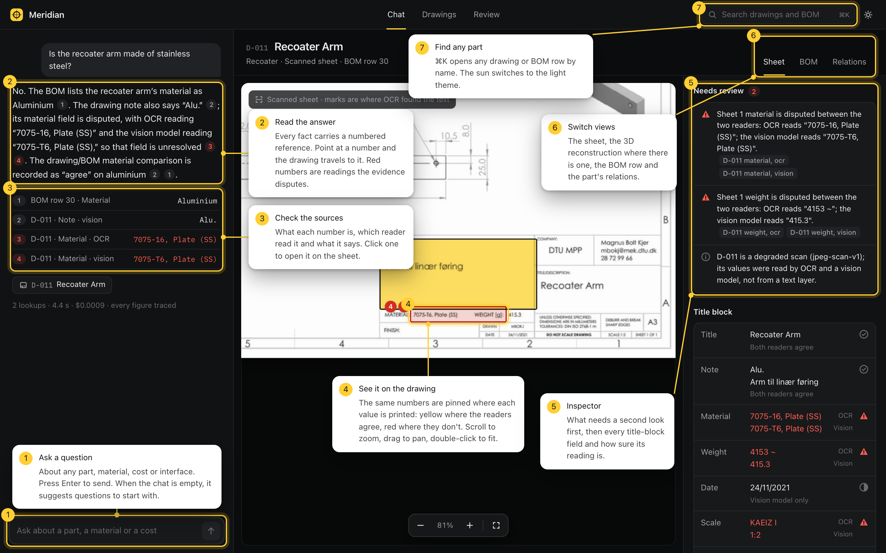
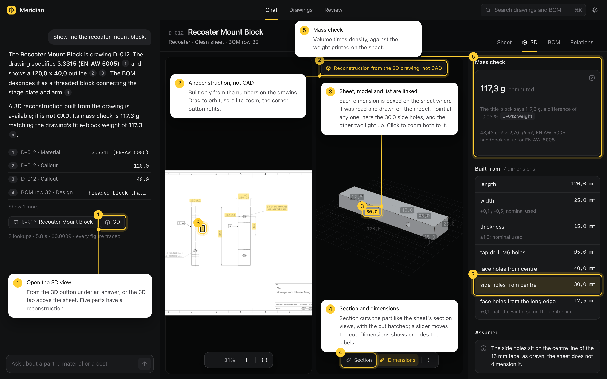
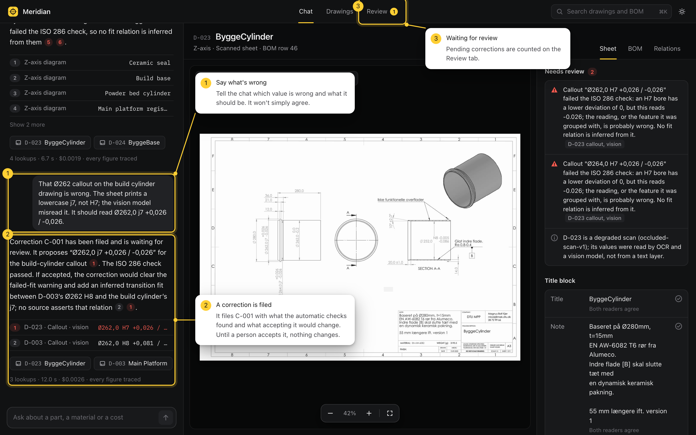
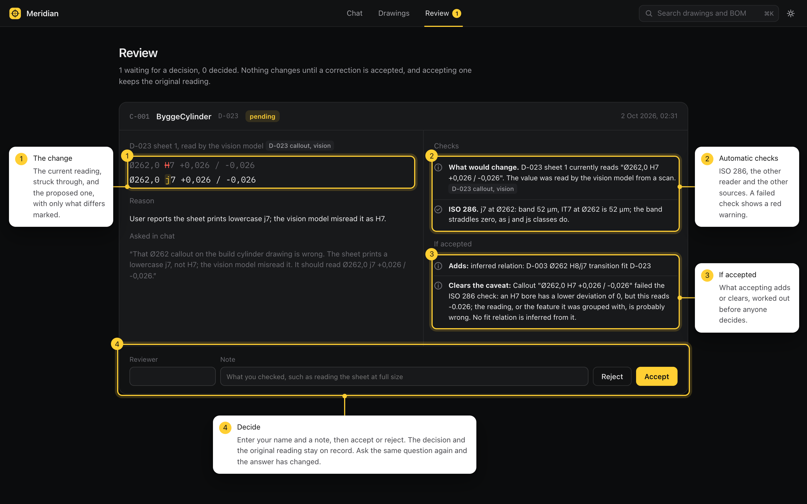
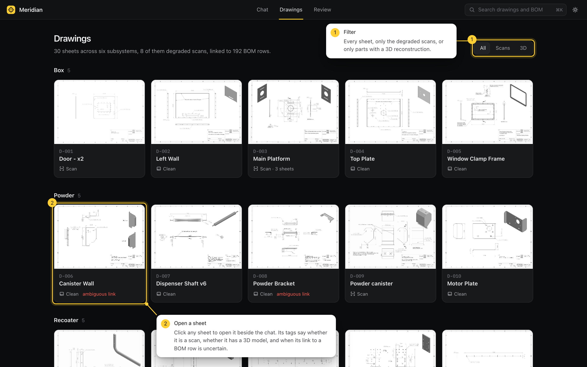
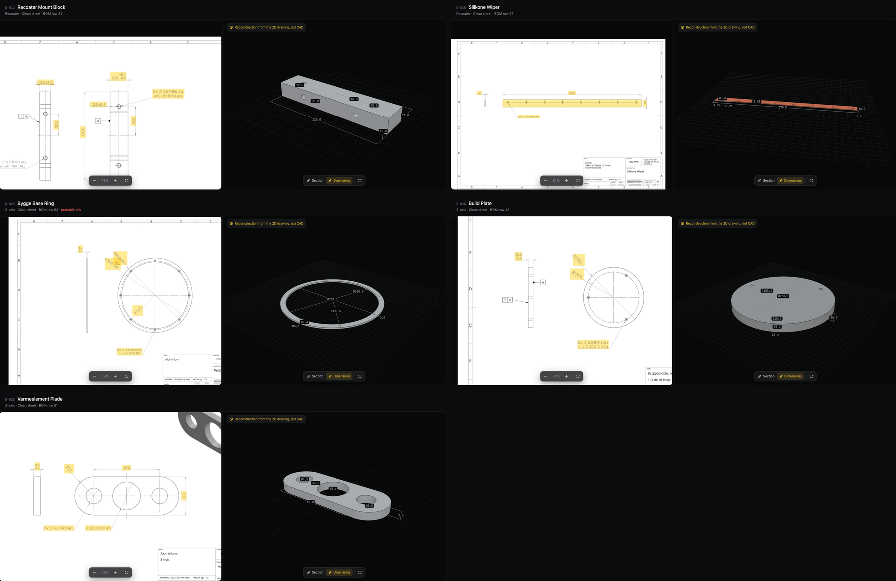
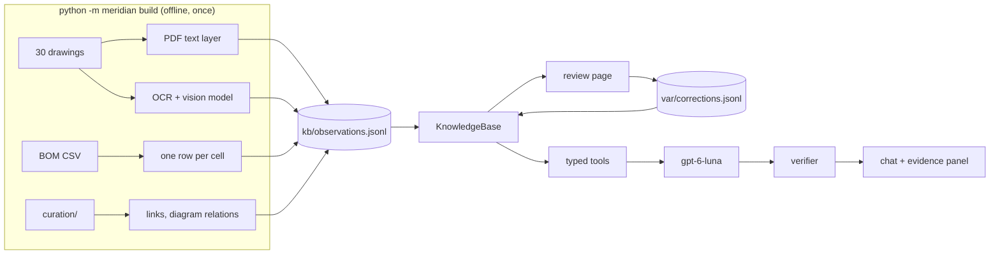
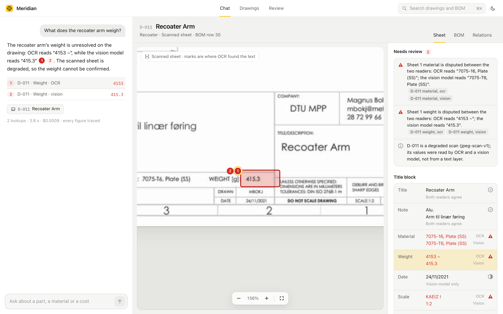

# Meridian

Chat over the drawings and bill of materials of the [OpenLPBF v2](https://github.com/DTUOpenAM/OpenLPBF_v2), a
metal laser powder-bed-fusion machine. Every fact in an answer links to where it came from: a region of a sheet, a
BOM cell, a diagram label, or a correction someone accepted. Asking about a part opens its drawing, and the 3D view
when the part has one. When the sources disagree, or a scan cannot be read, the answer says so.

The assignment brief is in [docs/brief.md](docs/brief.md).


## Getting started

### What you need

- macOS or Linux. On Windows, use WSL, or follow [Without the script](#without-the-script) below.
- Python 3.11 or newer. Check with `python3 --version`. To install it: `brew install python@3.12` on macOS, or
  `sudo apt install python3.12 python3.12-venv` on Ubuntu.
- An internet connection the first time, to install three Python packages.
- Optional: an OpenAI API key, for live answers. Everything else works without one.

### 1. Start it

From the project folder:

```bash
./start.sh
```

The first run creates a virtual environment in `.venv`, installs FastAPI, uvicorn and the OpenAI client into it, and
prints `Meridian on http://localhost:8000`. Later runs start in about a second. The knowledge base in `kb/` is
already built and committed, so nothing is extracted at startup and no system packages are needed.

### 2. Open it

Go to **http://localhost:8000**. A laptop-sized window or larger shows the full layout; narrower windows stack the
panels.

### 3. Add an API key (optional)

The first run creates `.env` from `.env.example`. Open it, set the key, then stop the server with Ctrl+C and run
`./start.sh` again:

```
OPENAI_API_KEY=sk-...
```

With a key, each answer is written live and shows its time and cost underneath. Without one, the example questions
replay their recorded answers from the last evaluation run, labelled as recordings, and any other question shows
the evidence for the part it names. Drawings, 3D views and the review page work the same either way.

### Stopping, ports and starting over

- Stop the server with Ctrl+C in its terminal.
- Use another port with `PORT=8001 ./start.sh`.
- Clear the review history by deleting `var/corrections.jsonl`. It is append-only and never committed.

### Without the script

The same steps by hand, for Windows or anywhere `start.sh` cannot run. If `python3 --version` is older than 3.11,
use the newer one by name in the first command, for example `python3.12`.

```bash
python3 -m venv .venv
```

```bash
.venv/bin/pip install -r requirements.txt
```

```bash
cp .env.example .env
```

```bash
.venv/bin/python -m meridian serve --port 8000
```

On Windows, use `py -3.12 -m venv .venv`, then `.venv\Scripts\pip` and `.venv\Scripts\python` in place of the
`.venv/bin` paths, and `copy` in place of `cp`.

### If something goes wrong

| What you see | What to do |
|---|---|
| `Meridian needs Python 3.11 or newer` | Install a newer Python (above), then run `./start.sh` again |
| `permission denied: ./start.sh` | Run `bash start.sh`, or make it executable once with `chmod +x start.sh` |
| `address already in use` | Something else has port 8000: `PORT=8001 ./start.sh` |
| Chat says no API key is configured | Put the key in `.env` and restart the server |
| The page looks out of date after an update | Reload it |

## How to use it

### Ask, and see where the answer comes from



1. **Ask a question** about any part, material, cost or interface, and press Enter. An empty chat suggests
   questions to start with.
2. **Read the answer.** Every fact carries a numbered reference. Point at a number and the drawing travels to it.
   Red numbers are readings the evidence disputes.
3. **Check the sources.** Under each answer, each number says what it is, which reader read it and what it says.
   Click one to open it on the sheet.
4. **See it on the drawing.** The same numbers are pinned where each value is printed: yellow where the readers
   agree, red where they don't. Scroll to zoom, drag to pan, double-click to fit.
5. **The inspector** lists what needs a second look first, then every title-block field and how sure its reading is.
6. **Switch views** between the sheet, the 3D reconstruction where there is one, the BOM row and the part's
   relations.
7. **Find any part** with ⌘K (Ctrl K on Windows and Linux). The sun in the corner switches to the light theme.

### Explore a part in 3D



1. **Open the 3D view** from the 3D button under an answer, or the 3D tab above the sheet. Five parts have one.
2. **It is a reconstruction, not CAD:** built only from the numbers on the drawing. Drag to orbit, scroll to zoom;
   the corner button refits.
3. **Sheet, model and list are linked.** Each dimension is boxed on the sheet where it was read and drawn on the
   model. Point at any one and the other two light up; click to zoom both to it, and press Esc to let go.
4. **Section** cuts the part like the sheet's section views, hatched, and a slider moves the cut. **Dimensions**
   shows or hides the labels.
5. **The mass check** compares volume times density with the weight printed on the sheet. All five agree within
   0.75 %.

### Correct a value



1. **Say what's wrong.** Tell the chat which value is wrong and what it should be. For example, ask "What does the
   build cylinder fit into?", then: "That Ø262 callout on the build cylinder drawing is wrong. The sheet prints a
   lowercase j7, not H7. It should read Ø262,0 j7 +0,026 / -0,026."
2. **A correction is filed** instead of the chat simply agreeing, with what the automatic checks found and what
   accepting it would change.
3. **It waits for review.** Pending corrections are counted on the Review tab.



1. **The change:** the current reading struck through and the proposed one, with only what differs marked.
2. **Automatic checks:** ISO 286, the other reader and the other sources.
3. **If accepted:** what accepting adds or clears, worked out before anyone decides.
4. **Decide.** Enter your name and a note, then accept or reject. Ask the first question again: the answer now
   gives the H8/j7 fit with the main platform, names the correction, and still cites the original "H7" reading.

### Browse every drawing



1. **Filter** to every sheet, only the degraded scans, or only the parts with a 3D reconstruction.
2. **Open a sheet** by clicking it. Its tags say whether it is a scan, whether it has a 3D model, and when its link
   to a BOM row is uncertain.

### Keyboard

| Key | What it does |
|---|---|
| ⌘K, or Ctrl K | Find a drawing or BOM row by name |
| `/` | Jump to the question box |
| Enter, Shift+Enter | Send the question, or start a new line |
| Esc | Close the finder, or let go of a pinned dimension in the 3D view |
| Double-click a sheet | Fit it to the view |

### Things to try

| Ask | What to look for |
|---|---|
| Show me the recoater mount block. | Opens the drawing, with a 3D button for the sheet and the model side by side |
| How thick is the heating element plate? | The sheet prints a limit, 3,0 over 2,0; the model was built at 2,0, the value the title-block weight matches |
| Which drawing documents the recoater stage plate? | Names D-014 and raises that its BOM row lists D-013's file |
| Is the recoater arm made of stainless steel? | Aluminium by the BOM and the sheet's note; the scanned material field is disputed, and both readings are quoted |
| What does the recoater arm weigh? | A scanned sheet: shows what each reader saw and which ones agree |
| Is the BOM's motor plate drawing D-029 or D-030? | Says the evidence cannot tell, and why |
| What did the Box subsystem cost, and what is missing from that figure? | A total from a dated snapshot, with the rows that have no cost |

### All five reconstructions

Each sheet with the dimensions its model was built from boxed in yellow, beside the model:



## How it works



**Observations, not fields.** The unit of knowledge is one source saying one thing in one place: "BOM row 30,
Material: Aluminium", "D-011 title block, MATERIAL: 7075-T6, Plate (SS)". A part's material is never stored. It is
worked out when asked, along with whether its sources agree, conflict or are missing. Citations, the distinction
between a BOM claim and a drawing claim, abstention and the audit trail all come from that.

**Reading the sheets.** The 22 clean sheets are read from their PDF text layer: the title block by fixed cells, the
callouts by grouping nearby text, with the Ø, depth and counterbore symbols recognised from the drawn polylines that
replace them in the text layer. The eight scans are read twice, by tesseract and by the vision model, independently.
A value is "confirmed" only when both agree, and numbers have to agree exactly. Every fit tolerance is checked
against ISO 286.

**Links and relations.** Which BOM row a drawing documents is a curated decision with its reason
(`curation/links.csv`), and the automatic linker is scored against it. Relations come from the BOM's Interface with
column, from the system diagrams (transcribed, citing the label regions), and from matching fit sizes across sheets.
Each says which of the three it is.

**Chat.** The model sees nine tools over the knowledge base, never the documents. Caveats such as conflicting sources,
uncertain links and failed checks are computed and put first in every tool result, so the model relays them rather
than having to notice them. Before an answer is shown, a check rejects any citation that does not exist and any
number that is in no tool result. Which sheet and 3D view to open is decided on the server from the tools that were
called.

**3D.** Five clean, simple parts are rebuilt from their dimensions with constructive solid geometry
(`meridian/geometry.py`). Each dimension cites its callout, or says how it was measured or why it was assumed, and
says where it is drawn on the model and where it sits on the sheet; a test checks that every drawn dimension is as
long as its label. The computed mass is checked against the weight
SolidWorks printed in the title block. All five are within 0.75 %. The view says it is a reconstruction, not CAD.

**Corrections** are events. Accepting one adds an observation that supersedes the original for display. The original
keeps its id and its place on the sheet. Inferred relations are recomputed on load, so an accepted correction can
create or remove one, and the review page shows that impact before anyone decides.

The reasoning behind each choice, including the ones that did not work, is in [DECISIONS.md](DECISIONS.md).

## How well it works

Measured with `python -m meridian score` and `python -m meridian eval`. Details, error analysis and every run's raw
output are in [EVALUATION.md](EVALUATION.md).

| | |
|---|---|
| Title-block fields, clean sheets | 161 / 161 |
| Title-block fields, scans: OCR / vision model / settled | 36 / 69 / 58 of 70 |
| Scan fields shown as confirmed while wrong | 0 |
| Automatic linker against curation | 18 / 26 |
| 3D mass check, largest difference | 0.74 % |
| Chat questions passing every check, two runs | 26 / 28 and 27 / 28 |
| Same verdict in both runs | 27 / 28 |
| Content checks, this vs. pasting all documents into the prompt | 26 vs. 12 of 28 |
| Latency, median / 90th percentile | 4.3 s / 7.1 s |
| Cost per answer, median | $0.0009 |

## Limitations

- Callouts on scans that only the vision model read have no position on the sheet. Citing one opens the sheet but
  outlines nothing.
- Callout grouping is by proximity. On D-024 it attaches a tolerance to the wrong holes; the ISO 286 check flags it,
  but it is not fixed.
- Single-reader scan values are shown with a caveat rather than hidden. One of them, D-003 sheet 2's scale, is wrong.
- The links, diagram relations and title-block truth set were curated by one person, me. Four links are left
  ambiguous and five are marked probable.
- Supplier, price and order number answers come from a BOM snapshot (retrieved 2 September 2026), and say so. Nothing is
  checked against current availability. The brief's bonus items (finding new suppliers, a graph view) were not built.
- Without an API key, recorded answers do not change after a correction is accepted. The drawings and review pages
  do.
- One user, one process: the review log has no locking.

## Models, services and data sent out

- **OpenAI `gpt-6-luna`**, through the Responses API with `store=false`.
  - At build time, each of the ten scanned sheet images and an enlarged crop of its title block are sent once to be
    transcribed. The responses are cached in `kb/vision/`, so running or rebuilding the app does not send them again.
    The title blocks include the designer's name and contact details, which are public upstream and are not extracted.
  - In chat, the question, the last few messages and the tool results are sent: extracted text from the BOM and
    drawings, never the PDFs or images.
  - `meridian eval` also sends the BOM and every sheet's extracted text, for the baseline.
- **Tesseract** runs locally, at build time only.
- No other services. Fonts (IBM Plex, OFL) and three.js (MIT) are vendored under `web/vendor/` with their licences.
- The upstream originals of the eight degraded sheets and the upstream CAD files were not used.

## Rebuilding and testing

The committed `kb/` is the output of a build. To rebuild it, install tesseract (`brew install tesseract`) and:

```bash
.venv/bin/pip install -r requirements-build.txt
```

```bash
.venv/bin/python -m meridian build
```

A rebuild with the vision responses cached takes about 7 seconds and makes no API calls. Then:

```bash
.venv/bin/python -m pytest
```

```bash
.venv/bin/python -m meridian score
```

```bash
.venv/bin/python -m meridian eval
```

`eval` needs a key, takes about two minutes and costs about $0.13. It writes a new folder in `eval/runs/` and refreshes
the recorded answers.

## Layout

```
meridian/            the Python package
  evidence.py        Observation, Source: the data model
  sheets/            reading drawings: template, text layer, callouts, OCR, vision model
  bom.py             reading the BOM, one observation per cell
  reading.py         settling two readers into confirmed, disputed, single reader or blank
  iso286.py          tolerance grade checks
  linking.py         sheet-to-row candidates, and the curated decisions
  relations.py       stated, diagram and inferred relations
  knowledge.py       the KnowledgeBase every answer goes through
  corrections.py     proposals, checks, impact and decisions
  geometry.py        the five 3D reconstructions
  chat/              tools, instructions, the answer check and the agent loop
  server.py          the API and static files
  build.py           dataset -> kb/
  evaluation.py      the chat evaluation
web/                 the UI: plain ES modules, no build step
curation/            human decisions the build reads, with reasons
kb/                  build output: observations, relations, page images, 3D models
eval/                truth set, questions, every run, recorded answers
tests/               parsing, settling, checking and correction rules
dataset/             the supplied drawings, BOM and diagrams, unchanged
docs/                the assignment brief, the annotated guide and screenshots
```

## More screenshots

The build plate in section, after clicking the counterbore depth: the sheet has zoomed to the hole callout and the
model to the counterbore, cut and hatched:


The correction accepted, and the same question asked again afterwards:


An answer that raises a datasheet conflict, with the drawing opened beside it:


The light theme, on a scanned weight the two readers disagree about:



## Attribution

The dataset is curated from [DTUOpenAM/OpenLPBF_v2](https://github.com/DTUOpenAM/OpenLPBF_v2) at commit
`98f76dad`, licensed under CERN-OHL-P-2.0. See [ATTRIBUTION.md](ATTRIBUTION.md) and
`dataset/context/OpenLPBF-LICENSE.md`.
