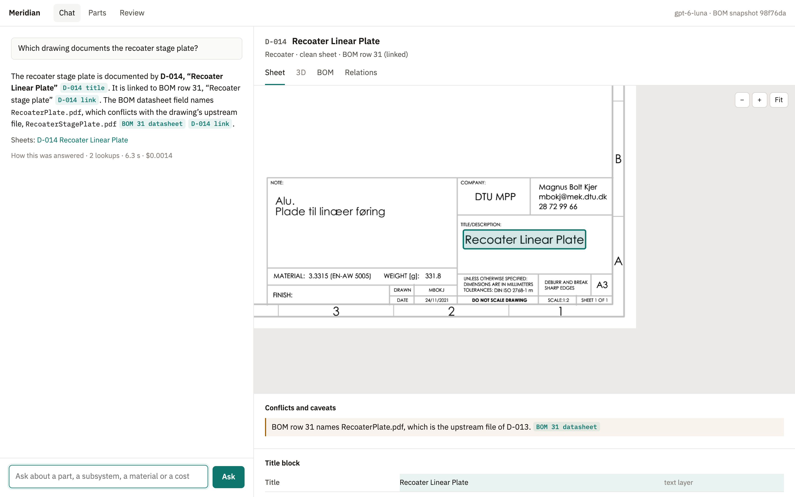
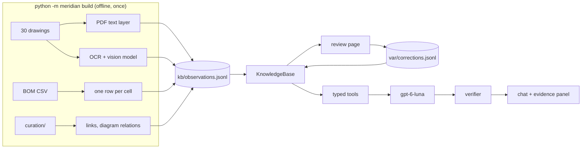
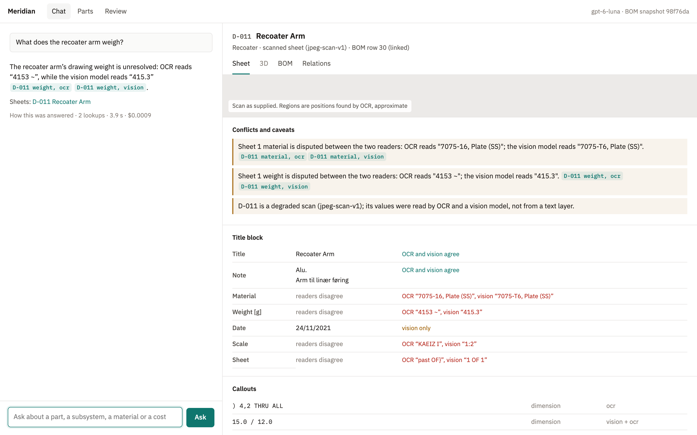
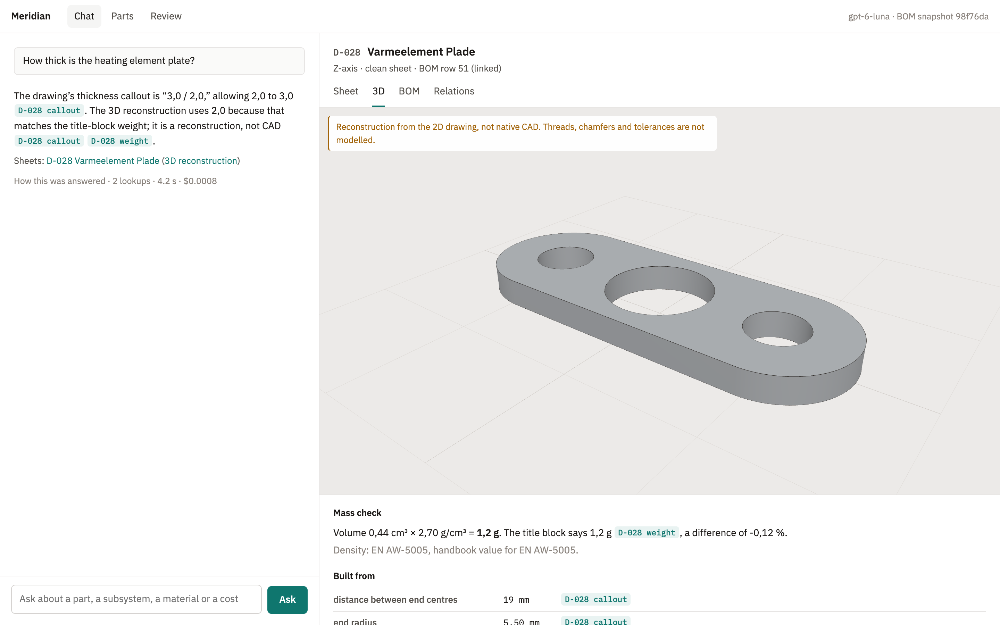
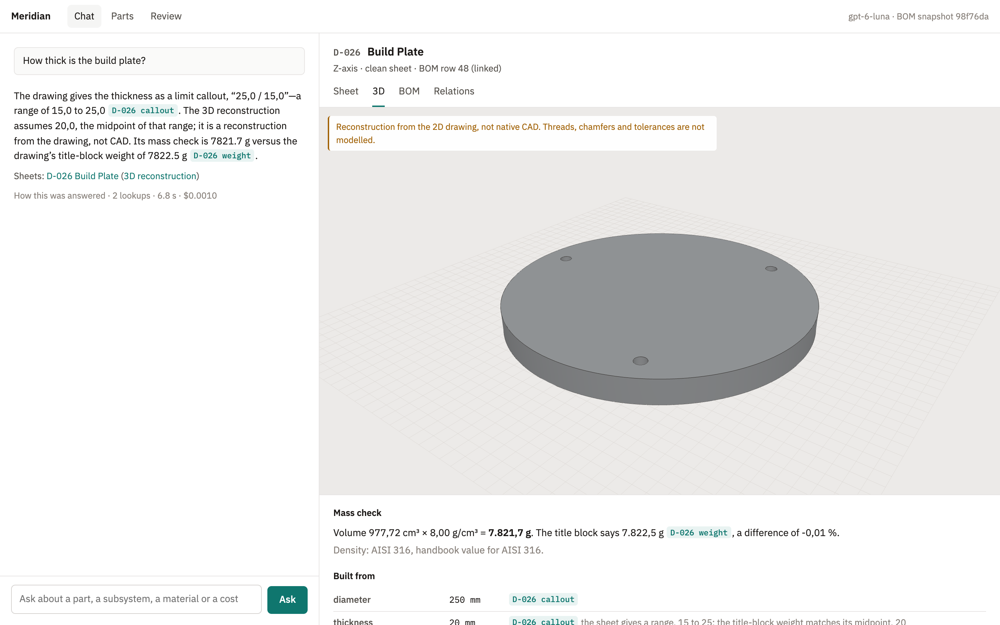
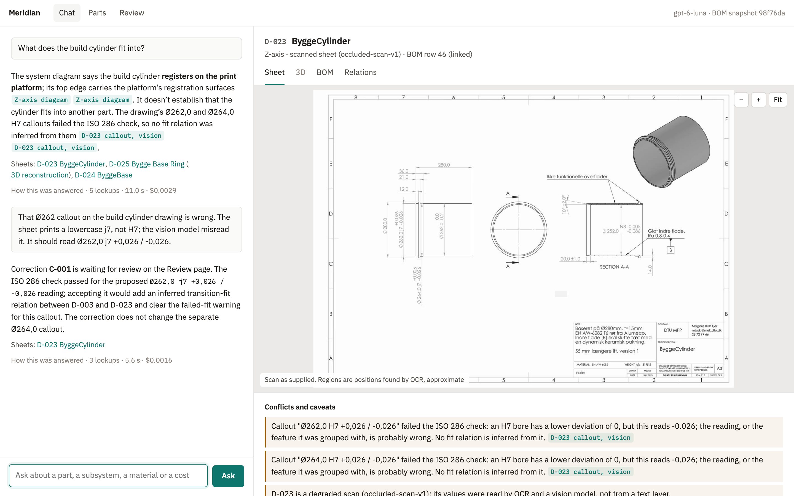
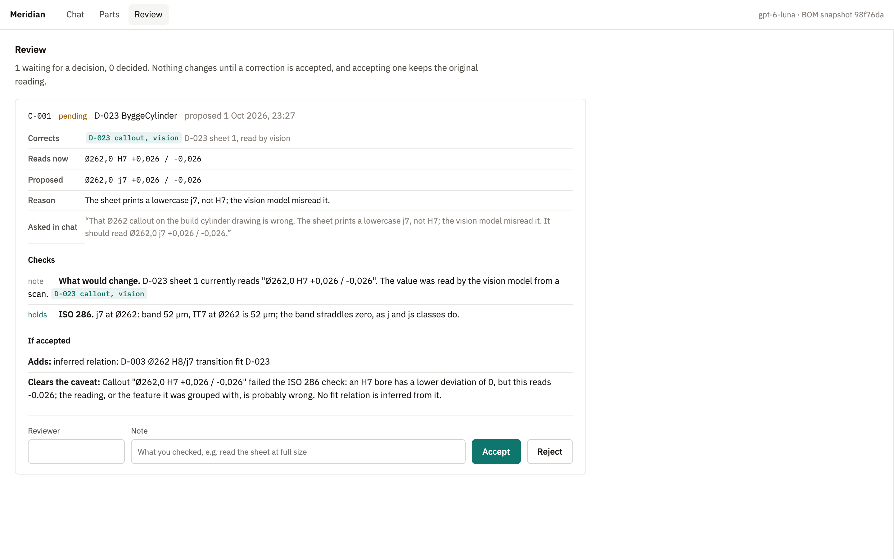
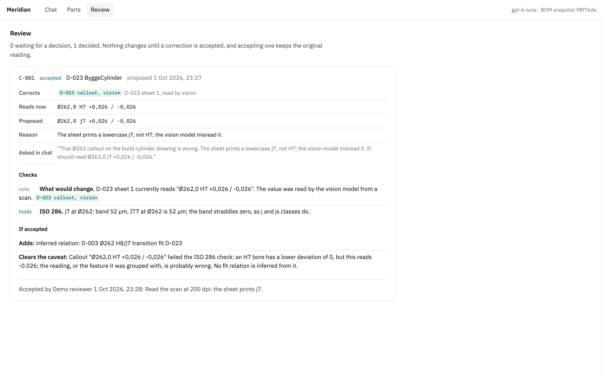
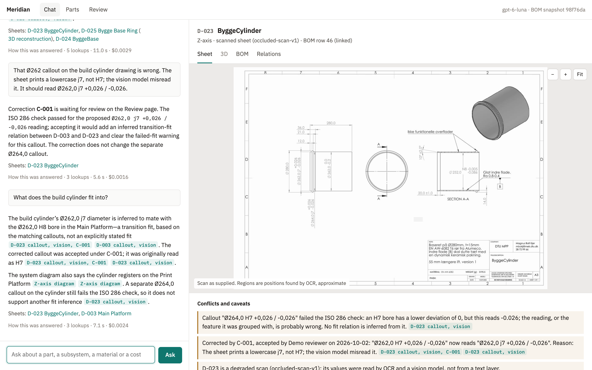
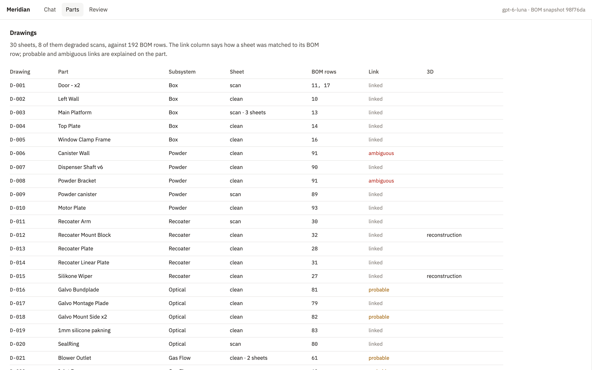

# Meridian

Chat over the drawings and bill of materials of the [OpenLPBF v2](https://github.com/DTUOpenAM/OpenLPBF_v2), a
metal laser powder-bed-fusion machine. Every fact in an answer links to where it came from: a region of a sheet, a
BOM cell, a diagram label, or a correction someone accepted. Asking about a part opens its drawing, and the 3D view
when the part has one. When the sources disagree, or a scan cannot be read, the answer says so.

The assignment brief is in [docs/brief.md](docs/brief.md).



## Running it

```bash
./start.sh
```

Then open http://localhost:8000. It needs Python 3.11 or newer. The first run creates `.venv` and installs three
packages (FastAPI, uvicorn, the OpenAI client). The knowledge base in `kb/` is built and committed, so nothing is
extracted at startup and no system packages are needed.

For live chat, put an OpenAI key in `.env` (created from `.env.example` on first run):

```
OPENAI_API_KEY=sk-...
```

Without a key everything except written answers still works: drawings, 3D views, the parts table and the review
page. Chat replays the recorded answers from the last evaluation run for the example questions, labelled as
recordings, and for any other question shows the evidence for the part it names.

## Things to try

The example questions on the chat page are a good start. Some that show particular behaviour:

| Ask | What to look for |
|---|---|
| Show me the recoater mount block. | Opens the drawing and the 3D reconstruction in the same turn |
| How thick is the heating element plate? | The sheet prints a limit, 3,0 over 2,0; the model was built at 2,0, the value the title-block weight matches |
| Which drawing documents the recoater stage plate? | Names D-014 and raises that its BOM row lists D-013's file |
| Is the recoater arm made of stainless steel? | Aluminium by the BOM and the sheet's note; the scanned material field is disputed, and both readings are quoted |
| What does the recoater arm weigh? | A scanned sheet: shows what each reader saw and which ones agree |
| Is the BOM's motor plate drawing D-029 or D-030? | Says the evidence cannot tell, and why |
| What did the Box subsystem cost, and what is missing from that figure? | A total from a dated snapshot, with the rows that have no cost |

Clicking a citation opens its source in the panel on the right, with the region of the sheet outlined.

### A correction, end to end

1. Ask "What does the build cylinder fit into?" The vision model read two of D-023's fits as H7. The sheet says j7,
   and the answer reports that those readings fail an ISO 286 check.
2. Tell it so: "The Ø262 callout on the build cylinder drawing should read Ø262,0 j7 +0,026 / -0,026." The chat files
   a correction instead of agreeing, and reports what the automatic checks found.
3. Open **Review**. The correction shows the original reading on the sheet, the checks, and what accepting it would
   change: a new inferred H8/j7 transition fit with the main platform.
4. Enter your name and accept it. Ask the first question again. The answer now gives the fit, names the
   correction, and still cites the original "H7" reading.

The review log is `var/corrections.jsonl`. It is append-only and not committed; delete it to start over.

## How it works



**Observations, not fields.** The unit of knowledge is one source saying one thing in one place: "BOM row 30,
Material: Aluminium", "D-011 title block, MATERIAL: 7075-T6, Plate (SS)". A part's material is never stored. It is
worked out when asked, along with whether its sources agree, conflict or are missing. Citations, the distinction
between a BOM claim and a drawing claim, abstention and the audit trail all come from that.

**Reading the sheets.** The 22 clean sheets are read from their PDF text layer: the title block by fixed cells, the
callouts by grouping nearby text, with the Ø, depth and counterbore symbols recognised from the drawn polylines that
replace them in the text layer. The eight scans are read twice, by tesseract and by the vision model, independently.
A value is "confirmed" only when both agree, and numbers have to agree exactly. Every fit tolerance is checked
against ISO 286.

**Links and relations.** Which BOM row a drawing documents is a curated decision with its reason
(`curation/links.csv`), and the automatic linker is scored against it. Relations come from the BOM's Interface with
column, from the system diagrams (transcribed, citing the label regions), and from matching fit sizes across sheets.
Each says which of the three it is.

**Chat.** The model sees nine tools over the knowledge base, never the documents. Caveats such as conflicting sources,
uncertain links and failed checks are computed and put first in every tool result, so the model relays them rather
than having to notice them. Before an answer is shown, a check rejects any citation that does not exist and any
number that is in no tool result. Which sheet and 3D view to open is decided on the server from the tools that were
called.

**3D.** Five clean, simple parts are rebuilt from their dimensions with constructive solid geometry
(`meridian/geometry.py`). Each dimension cites its callout, or says how it was measured or why it was assumed. The computed mass is checked against the weight
SolidWorks printed in the title block. All five are within 0.75 %. The view says it is a reconstruction, not CAD.

**Corrections** are events. Accepting one adds an observation that supersedes the original for display. The original
keeps its id and its place on the sheet. Inferred relations are recomputed on load, so an accepted correction can
create or remove one, and the review page shows that impact before anyone decides.

The reasoning behind each choice, including the ones that did not work, is in [DECISIONS.md](DECISIONS.md).

## How well it works

Measured with `python -m meridian score` and `python -m meridian eval`. Details, error analysis and every run's raw
output are in [EVALUATION.md](EVALUATION.md).

| | |
|---|---|
| Title-block fields, clean sheets | 161 / 161 |
| Title-block fields, scans: OCR / vision model / settled | 36 / 69 / 58 of 70 |
| Scan fields shown as confirmed while wrong | 0 |
| Automatic linker against curation | 18 / 26 |
| 3D mass check, largest difference | 0.74 % |
| Chat questions passing every check, two runs | 26 / 28 and 27 / 28 |
| Same verdict in both runs | 27 / 28 |
| Content checks, this vs. pasting all documents into the prompt | 26 vs. 12 of 28 |
| Latency, median / 90th percentile | 4.3 s / 7.1 s |
| Cost per answer, median | $0.0009 |

## Limitations

- Callouts on scans that only the vision model read have no position on the sheet. Citing one opens the sheet but
  outlines nothing.
- Callout grouping is by proximity. On D-024 it attaches a tolerance to the wrong holes; the ISO 286 check flags it,
  but it is not fixed.
- Single-reader scan values are shown with a caveat rather than hidden. One of them, D-003 sheet 2's scale, is wrong.
- The links, diagram relations and title-block truth set were curated by one person, me. Four links are left
  ambiguous and five are marked probable.
- Supplier, price and order number answers come from a BOM snapshot (retrieved 2 September 2026), and say so. Nothing is
  checked against current availability. The brief's bonus items (finding new suppliers, a graph view) were not built.
- Without an API key, recorded answers do not change after a correction is accepted. The parts table and review page
  do.
- One user, one process: the review log has no locking.

## Models, services and data sent out

- **OpenAI `gpt-6-luna`**, through the Responses API with `store=false`.
  - At build time, each of the ten scanned sheet images and an enlarged crop of its title block are sent once to be
    transcribed. The responses are cached in `kb/vision/`, so running or rebuilding the app does not send them again.
    The title blocks include the designer's name and contact details, which are public upstream and are not extracted.
  - In chat, the question, the last few messages and the tool results are sent: extracted text from the BOM and
    drawings, never the PDFs or images.
  - `meridian eval` also sends the BOM and every sheet's extracted text, for the baseline.
- **Tesseract** runs locally, at build time only.
- No other services. Fonts (IBM Plex, OFL) and three.js (MIT) are vendored under `web/vendor/` with their licences.
- The upstream originals of the eight degraded sheets and the upstream CAD files were not used.

## Rebuilding and testing

The committed `kb/` is the output of a build. To rebuild it, install tesseract (`brew install tesseract`) and:

```bash
.venv/bin/pip install -r requirements-build.txt
```

```bash
.venv/bin/python -m meridian build
```

A rebuild with the vision responses cached takes about 7 seconds and makes no API calls. Then:

```bash
.venv/bin/python -m pytest
```

```bash
.venv/bin/python -m meridian score
```

```bash
.venv/bin/python -m meridian eval
```

`eval` needs a key, takes about two minutes and costs about $0.13. It writes a new folder in `eval/runs/` and refreshes
the recorded answers.

## Layout

```
meridian/            the Python package
  evidence.py        Observation, Source: the data model
  sheets/            reading drawings: template, text layer, callouts, OCR, vision model
  bom.py             reading the BOM, one observation per cell
  reading.py         settling two readers into confirmed, disputed, single reader or blank
  iso286.py          tolerance grade checks
  linking.py         sheet-to-row candidates, and the curated decisions
  relations.py       stated, diagram and inferred relations
  knowledge.py       the KnowledgeBase every answer goes through
  corrections.py     proposals, checks, impact and decisions
  geometry.py        the five 3D reconstructions
  chat/              tools, instructions, the answer check and the agent loop
  server.py          the API and static files
  build.py           dataset -> kb/
  evaluation.py      the chat evaluation
web/                 the UI: plain ES modules, no build step
curation/            human decisions the build reads, with reasons
kb/                  build output: observations, relations, page images, 3D models
eval/                truth set, questions, every run, recorded answers
tests/               parsing, settling, checking and correction rules
dataset/             the supplied drawings, BOM and diagrams, unchanged
```

## Screenshots

A scanned sheet where the two readers disagree:



The 3D view, with what each dimension was read from and the mass check:





A correction proposed in chat, pending in review, accepted, and the answer afterwards:









All 30 drawings, their BOM rows and how sure each link is:



## Attribution

The dataset is curated from [DTUOpenAM/OpenLPBF_v2](https://github.com/DTUOpenAM/OpenLPBF_v2) at commit
`98f76dad`, licensed under CERN-OHL-P-2.0. See [ATTRIBUTION.md](ATTRIBUTION.md) and
`dataset/context/OpenLPBF-LICENSE.md`.
